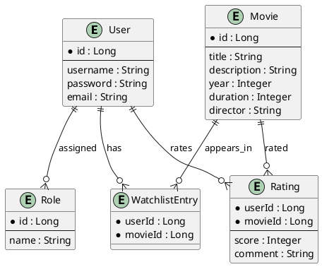

## Inhaltsverzeichnis-
[[#Github Repo's|Github Repo's]]
- [[#📚 Projektübersicht|📚 Projektübersicht]]
- [[#🔐 Features|🔐 Features]]
- [[#🧠 Technische Architektur|🧠 Technische Architektur]]
- [[#📁 Wichtige Backend-Klassen|📁 Wichtige Backend-Klassen]]
    - [[#📁 Wichtige Backend-Klassen#`RatingService.java`|`RatingService.java`]]
    - [[#📁 Wichtige Backend-Klassen#`TmdbService.java`|`TmdbService.java`]]
- [[#⚙️ Beispiel-Testfälle|⚙️ Beispiel-Testfälle]]
    - [[#⚙️ Beispiel-Testfälle#✅ Bewertung hinzufügen (Integration)|✅ Bewertung hinzufügen (Integration)]]
    - [[#⚙️ Beispiel-Testfälle#✅ Movie automatisch speichern (Backend)|✅ Movie automatisch speichern (Backend)]]
    - [[#⚙️ Beispiel-Testfälle#❌ Fehlerhafte Bewertung|❌ Fehlerhafte Bewertung]]
- [[#🧪 Tools|🧪 Tools]]
- [[#🐛 Bekannte Probleme|🐛 Bekannte Probleme]]
- [[#📝 Erweiterungen|📝 Erweiterungen]]
- [[#🔐 Security Hinweis|🔐 Security Hinweis]]
- [[#👨‍🔧 Projektstruktur (Frontend)|👨‍🔧 Projektstruktur (Frontend)]]
- [[#📊 Datenmodell (PlantUML)|📊 Datenmodell (PlantUML)]]
- [[#🛠 Installation & Setup|🛠 Installation & Setup]]
- [[#🧪 Beispiel-Testfälle (manuell)|🧪 Beispiel-Testfälle (manuell)]]
- [[#✅ Use Cases & Tests (automatisierbar)|✅ Use Cases & Tests (automatisierbar)]]
    - [[#✅ Use Cases & Tests (automatisierbar)#🧪 Backend Unit Tests (JUnit 5)|🧪 Backend Unit Tests (JUnit 5)]]
        - [[#🧪 Backend Unit Tests (JUnit 5)#✅ `RatingServiceTest.java`|✅ `RatingServiceTest.java`]]
        - [[#🧪 Backend Unit Tests (JUnit 5)#✅ `TmdbServiceTest.java`|✅ `TmdbServiceTest.java`]]
        - [[#🧪 Backend Unit Tests (JUnit 5)#✅ `AuthTokenFilterTest.java`|✅ `AuthTokenFilterTest.java`]]
    - [[#✅ Use Cases & Tests (automatisierbar)#🧪 Frontend Unit Tests (Jest + React Testing Library)|🧪 Frontend Unit Tests (Jest + React Testing Library)]]
        - [[#🧪 Frontend Unit Tests (Jest + React Testing Library)#✅ `RatingForm.test.jsx`|✅ `RatingForm.test.jsx`]]
        - [[#🧪 Frontend Unit Tests (Jest + React Testing Library)#✅ `MovieCard.test.jsx`|✅ `MovieCard.test.jsx`]]
        - [[#🧪 Frontend Unit Tests (Jest + React Testing Library)#✅ `AuthService.test.js`|✅ `AuthService.test.js`]]
    - [[#✅ Use Cases & Tests (automatisierbar)#🧪 Integration Tests (Postman )|🧪 Integration Tests (Postman )]]
- [[#📌 Zusätzliche Ideen für Validierungstests|📌 Zusätzliche Ideen für Validierungstests]]
- [[#📒 Arbeitsjournal – Projekt Movie Watchlist|📒 Arbeitsjournal – Projekt Movie Watchlist]]
    - [[#📒 Arbeitsjournal – Projekt Movie Watchlist#🔁 Vorgehen|🔁 Vorgehen]]
    - [[#📒 Arbeitsjournal – Projekt Movie Watchlist#📅 Arbeitsjournal (chronologisch)|📅 Arbeitsjournal (chronologisch)]]
- [[#📊 Soll-Ist-Analyse|📊 Soll-Ist-Analyse]]


## Github Repo's
Backend:
- [FloCodin/Modul223Backend](https://github.com/FloCodin/Modul223Backend)
  Frontend:
-  [FloCodin/m233_frontend](https://github.com/FloCodin/m233_frontend)
# 🎬 Movie Watchlist App – Projektdokumentation

## 📚 Projektübersicht

Dies ist eine Fullstack Webapplikation zur Verwaltung einer persönlichen **Movie-Watchlist** mit integrierter **Bewertungsfunktion**, **TMDB-Integration**, **JWT Authentifizierung** und **Rollensteuerung**.

- **Frontend:** React + TailwindCSS + Vite
- **Backend:** Spring Boot + JPA + JWT + MySQL
- **API:** The Movie Database (TMDB)

## 🔐 Features

- ✅ Nutzerregistrierung & Login
- ✅ JWT-basierte Authentifizierung
- ✅ Rollen: `USER`, `ADMIN`
- ✅ Watchlist pro User
- ✅ Bewertungen mit Score (1–5) + Kommentar
- ✅ Automatisches Speichern von TMDB-Filmen,
- ✅ Filmübersicht mit Bild, Beschreibung, Jahr
- ✅ Integration von Toast-Messages für Feedback

---

## 🧠 Technische Architektur

```plaintext
React (Frontend)
│
├── Axios → /api/*
│
├── REST API
│   └── Spring Boot
│       ├── Controllers
│       ├── Services
│       ├── Repositories
│       ├── Entities: Movie, User, Rating, WatchlistEntry
│       ├── Security: JWT + Role-based Access
│       └── Database: MySQL
```

---

## 📁 Wichtige Backend-Klassen

### `RatingService.java`
```java
public Rating createRating(Long userId, RatingDTO ratingDto) {
    Movie movie = movieRepository.findById(ratingDto.movieId)
        .orElseGet(() -> {
            Movie fetched = tmdbService.fetchMovieFromTmdb(ratingDto.movieId);
            return movieRepository.save(fetched);
        });

    User user = userRepository.findById(userId)
        .orElseThrow(() -> new RuntimeException("User not found"));

    Rating rating = new Rating(user, movie, ratingDto.score, ratingDto.comment);
    return ratingRepository.save(rating);
}
```

### `TmdbService.java`
```java
public Movie fetchMovieFromTmdb(Long movieId) {
    RestTemplate restTemplate = new RestTemplate();
    String apiKey = "DEIN_TMDB_API_KEY";
    String url = "https://api.themoviedb.org/3/movie/" + movieId + "?api_key=" + apiKey + "&language=de-DE";
    ResponseEntity<Map> response = restTemplate.getForEntity(url, Map.class);

    if (!response.getStatusCode().is2xxSuccessful()) throw new RuntimeException("Movie fetch failed");

    Map<String, Object> data = response.getBody();
    Movie movie = new Movie();
    movie.setId(movieId);
    movie.setTitle((String) data.get("title"));
    movie.setDescription((String) data.get("overview"));
    movie.setDuration((Integer) data.get("runtime"));
    movie.setYear(Integer.parseInt(((String) data.get("release_date")).substring(0, 4)));
    movie.setDirector("Unbekannt");

    return movie;
}
```

---

## ⚙️ Beispiel-Testfälle

### ✅ Bewertung hinzufügen (Integration)
- 🔸 **Gegeben:** User ist eingeloggt
- 🔸 **Wenn:** User klickt auf „Rezension schreiben“
- 🔸 **Und:** Gibt Score 4 + Kommentar „War cool“ ein
- 🔸 **Dann:** POST /api/ratings ⇒ Status 200, neue Bewertung ist sichtbar

### ✅ Movie automatisch speichern (Backend)
- 🔸 **Gegeben:** Movie mit TMDB-ID 123 existiert nicht in DB
- 🔸 **Wenn:** User bewertet den Film
- 🔸 **Dann:** `TmdbService.fetchMovieFromTmdb()` wird aufgerufen → `movieRepository.save()` speichert Film

### ❌ Fehlerhafte Bewertung
- 🔸 **Gegeben:** Bewertung wird ohne gültigen Token gesendet
- 🔸 **Dann:** Backend gibt HTTP 403 zurück

---

## 🧪 Tools

- `Postman` oder `Thunder Client` zum Testen von Endpoints
- `MySQL Workbench` zur Datenbankanalyse
- `IntelliJ IDEA` mit Spring Boot Plugin
- `Vite + React` + `Toastify` für UI Feedback

---

## 🐛 Bekannte Probleme

- [x] 🧨 `ObjectOptimisticLockingFailureException` bei mehrfacher Speicherung (gelöst durch DTO & Update-Logik)
- [x] 🛠️ `NullPointerException` wenn `movieRepository` im `TmdbService` nicht `@Autowired` ist
- [x] 🟨 `UNSAFE_componentWillReceiveProps` Warnung in `react-rating` (nicht kritisch)

---

## 📝 Erweiterungen

- [ ] Bewertungen editierbar machen
- [ ] Likes/Dislikes zu Bewertungen
- [ ] Adminbereich mit Userübersicht
- [ ] Review-History pro User

---

## 🔐 Security Hinweis

- Bei **403 Forbidden** ohne Token → Token per `Authorization: Bearer <token>` senden
- Verwende `@PreAuthorize("hasRole('USER') or hasRole('ADMIN')")` an den REST-Endpunkten

---

## 👨‍🔧 Projektstruktur (Frontend)

```
src/
├── components/
│   ├── RatingForm.jsx
│   ├── MovieCard.jsx
├── pages/
│   ├── Watchlist.jsx
│   ├── MyRatings.jsx
│   ├── TmdbSearch.jsx
```

---

Letzte Änderung: 2025-05-26 14:29


---

## 📊 Datenmodell (PlantUML)



![[Pasted image 20250526171046.png]]
## 🛠 Installation & Setup

1. **Backend starten**
    ```bash
    ./mvnw spring-boot:run
    ```
   Voraussetzungen:
    - Java 22
    - MySQL mit Datenbank `demo`

2. **Frontend starten**
    ```bash
    npm install
    npm run dev
    ```

3. **Umgebungsvariablen (optional)**

    - `.env` für TMDB-API-Key:
      ```env
      VITE_TMDB_API_KEY=dein_tmdb_key
      ```

---

## 🧪 Beispiel-Testfälle (manuell)
- [x] Benutzer kann sich registrieren & einloggen
- [x] Bewertung für neuen TMDB-Film wird gespeichert und Film automatisch hinzugefügt
- [x] Bewertung wird mit bestehender überschrieben bei erneutem Speichern
- [x] Watchlist funktioniert unabhängig von Bewertungen


---

---

## ✅ Use Cases & Tests (automatisierbar)

### 🧪 Backend Unit Tests (JUnit 5)

#### ✅ `RatingServiceTest.java`
- `createRating_shouldSaveRating_whenMovieExists()`
- `createRating_shouldFetchAndSaveMovie_whenNotInDb()`
- `deleteRating_shouldRemoveRatingFromDatabase()`
- `getRatingsByUser_shouldReturnUserRatings()`

#### ✅ `TmdbServiceTest.java`
- `fetchMovieFromTmdb_shouldReturnValidMovieObject()`
- `fetchMovieFromTmdb_shouldThrowExceptionForInvalidId()`
- `getPopularMovies_shouldReturnList()`

#### ✅ `AuthTokenFilterTest.java`
- `shouldExtractValidJwt()`
- `shouldRejectInvalidJwt()`

### 🧪 Frontend Unit Tests (Jest + React Testing Library)

#### ✅ `RatingForm.test.jsx`
- `should render input fields correctly`
- `should submit rating and reset form on success`
- `should show error toast on API failure`

#### ✅ `MovieCard.test.jsx`
- `should render movie details`
- `should call handlers for watchlist and rating`

#### ✅ `AuthService.test.js`
- `should login and return user with token`
- `should logout and clear session storage`

### 🧪 Integration Tests (Postman )

- POST `/api/auth/login` → Login mit gültigem Benutzer
- GET `/api/tmdb/popular` → Liste der Filme von TMDB
- POST `/api/ratings` → Bewertung eines Films (mit Token)
- GET `/api/ratings/me` → Bewertungen des aktuellen Nutzers

---

## 📌 Zusätzliche Ideen für Validierungstests

- Token abgelaufen → Zugriff verweigert (401)
- Bewertung mit Score > 5 oder < 1 → Fehler (422)
- Film-ID nicht existent → `TmdbService` gibt Fehler zurück
- Rollenwechsel (`USER` → `ADMIN`) ohne Neuladen → keine Adminrechte sichtbar

------
## 📒 Arbeitsjournal – Projekt Movie Watchlist

### 🔁 Vorgehen

Wir haben uns für ein iteratives Vorgehen entschieden, orientiert am **agilen Modell**. Die Arbeit wurde in folgende Phasen aufgeteilt:

1. **Analyse und Planung**

2. **Backend-Setup inkl. Authentifizierung und Datenmodellierung**

3. **Frontend-Aufbau mit Design & Struktur (React + Tailwind)**

4. **Integration der TMDB-API & Bewertungssystem**

5. **Testing, Feinschliff und Dokumentation**


---

### 📅 Arbeitsjournal (chronologisch)

| Datum         | Aufgabe                          | Beschreibung                                                | Tools / Technologien   |
| ------------- | -------------------------------- | ----------------------------------------------------------- | ---------------------- |
| 03.05.2025    | Setup Projektstruktur            | Frontend- und Backend-Repository erstellt, Docker Container | GitHub, IntelliJ, Vite |
| 03.05.2025    | Authentifizierung Backend        | JWT Login, User Entity & Role-System implementiert          | Spring Boot, JPA       |
| 03.05.2025    | Datenbankanbindung               | Lokale MySQL mit User-, Movie- und Rating-Tabelle           | MySQL, Hibernate       |
| 10.05.2025    | Frontend Grundlayout             | Routing, Pages, Tailwind CSS Styling                        | React, Tailwind        |
| 17.05.2025    | Watchlist & Bewertung            | Entitäten + POST/GET/DELETE API-Endpunkte erstellt          | REST API, DTO          |
| -24.05.2025   | TMDB API Integration             | Dynamisches Abrufen von Movie-Details                       | TMDB v4, RestTemplate  |
| 24.05.2025    | Bewertungssystem im Frontend     | React-Komponente mit Sternsystem                            | react-rating, Toastify |
| 31.05.2025    | Tests Backend                    | CRUD-Tests für RatingController & Services                  | JUnit, MockMvc         |
| 31.05.2025    | Tests Frontend                   | Manuelle Tests: Login, Bewertung, Watchlist                 | Browser, Postman       |
| 26-31.05.2025 | Dokumentation                    | Technische Dokumentation & ReadMe begonnen                  | Markdown, PlantUML     |
| 31.05.2025    | Soll-Ist-Vergleich & Feinschliff | Übersicht, Analyse offener Punkte                           | Tabellen, Rückblick    |

---

## 📊 Soll-Ist-Analyse

|                          |                                                   |                                                                      |                               |
| ------------------------ | ------------------------------------------------- | -------------------------------------------------------------------- | ----------------------------- |
| Bereich                  | Soll-Zustand (geplant)                            | Ist-Zustand (erreicht)                                               | Abweichung / Bemerkung        |
| **Projektbeschrieb**     | Klar formulierte Projektidee mit TMDB & Watchlist | vollständig vorhanden                                                | ✅                             |
| **User Stories**         | 5–7 Use Cases inkl. Akzeptanzkriterien            | 6 Stück mit Fokus auf Bewertungen & Watchlist                        | ✅                             |
| **Sicherheitskonzept**   | JWT, Rollen, Zugriffsschutz                       | JWT implementiert, ROLE_USER / ADMIN                                 | ✅                             |
| **Backend-Architektur**  | saubere Trennung (Controller, Service, Repo)      | wurde sauber umgesetzt                                               | ✅                             |
| **Frontend-Architektur** | Komponentenbasiert, mit Pages und States          | React-Komponenten strukturiert vorhanden                             | ✅                             |
| **Impl. Backend**        | Bewertung & Watchlist, TMDB, Auth, User           | alle Kernfunktionen sind implementiert                               | ✅                             |
| **Impl. Frontend**       | Bewertung UI, Watchlist, Login                    | funktioniert erst teilweise, aber kleinere UX-Verbesserungen möglich | 🔶 leicht optimierbar         |
| **Tests**                | Backend automatisiert, Frontend manuell           | Backend vollständig, Frontend teils manuell                          | 🔶 Unit-Tests frontend fehlen |
| **Auswertung**           | Rückblick mit Soll-Ist-Vergleich                  | gerade erstellt (siehe oben)                                         | ✅                             |
| **Arbeitsjournal**       | chronologisch mit Tools & Datum                   | hier enthalten                                                       | ✅                             |
| **GitHub-Link**          | öffentlich verfügbar                              | vorhanden (beide Repos)                                              | ✅                             |

---